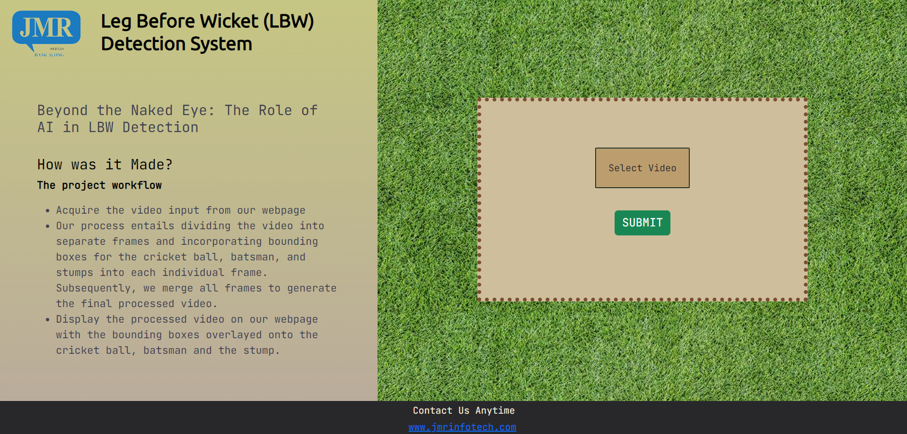
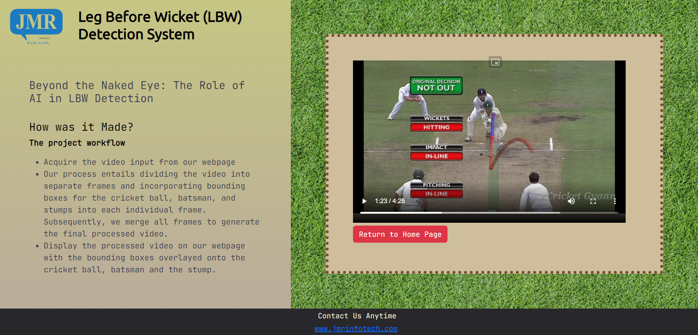

# Cricket DRS Ball tracker 

## Problem Statement  

#### "Track and predict the ball in cricket pitch right from the release action of the bowler's hand to hitting the batsman bat/pad or stumps. A video of the ball thrown at the pitch will be given as an input to detect & track the ball movement."

## Solution Overview

#### The solution developed to address the problem statement involved the following steps:
 
+ **Creating an optimal project workflow**
  + Acquire the video input from our webpage
  + Our process entails dividing the video into separate frames and incorporating bounding boxes for the cricket ball, batsman, and stumps into each individual frame. Subsequently, we merge all frames to generate the final processed video.
  + Display the processed video on our webpage
+ **The AI aspect of the project**
  + Made using **Python** and its corresponding libraries
  + Our first step is to retrieve the video input from the designated directory
  + Next, in order to feed the video input into our transformer, we needed to preprocess the data. To accomplish this, we utilized **OpenCV** to divide the video into individual frames, and applied a center crop to extract the relevant segments of the video. Subsequently, we fed each of these frames into our model one by one.
  + Our (model) employs (deep learning) to produce the coordinates of the cricket ball, batsman, and stumps for each individual frame. Subsequently, we overlay bounding boxes onto each set of generated coordinates within their corresponding frames. Finally, we integrate all the adjusted frames to generate the desired processed video that enables the tracking of the cricket ball.
  + We upload the processed video to its designated directory
+ **UI/UX aspect of the project**
  + Consists of two parts-> **Frontend** and **Backend**
  + **Frontend:**
    + A simple frontend made using **HTML,CSS and Bootstrap**
  + **Backend**
    + A backend made using **Flask,Jinja2 and Python**
    + Receives a video file input and saves it in the designated directory for processing by our model.
    + Displays the processed video file from its designated directory on the website

## User guide and code documentation

#### The web app hosted on a server provides a user-friendly interface that allows you to upload a video of a potentially dubious LBW decision. Once uploaded, the video is processed, and a bounding box is generated around the ball, which is then played back to you.

#### Once we have uploaded the required video, we can click on "Submit" to initiate the video processing. Once the processing is complete, the video will be displayed on the following screen.

## Code Snippets
Explaining the User Interface
### app.py
The main backend python file made with flask and jinja2 templating. It has thee following 2 routes-
~~~ 
 @app.route("/",methods=['GET','POST']) #Home Route
 @app.route("/video/<path>",methods=['GET','POST']) #Video Playback Route
 ~~~
 The following code saves the video from the user into the 'UPLOAD_FOLDER' specified 
 ~~~
 if request.method == 'POST':
    if 'file1' not in request.files:
        return 'there is no file1 in form!'
    file1 = request.files['file1']
    path = os.path.join(app.config['UPLOAD_FOLDER'], file1.filename)
    file1.save(path)
    return redirect(url_for('video',path=file1.filename))
~~~

The Templates folder contains two HTML files with the code for the 2 pages

## AI Model Explaination

### Documentation for Using the Roboflow API to Detect Objects in Images with Python

This documentation provides information on how to use the Roboflow API to detect objects in images using the `roboflow` library in Python.

## Prerequisites

Before you can use the Roboflow API, you will need the following:

- A Roboflow account
- An API key from your Roboflow account

## Installation

To install the `roboflow` library, run the following command:

```python
!pip install roboflow
```
## Usage

To use the `roboflow` library to detect objects in images using the Roboflow API, follow these steps:

1. Import the `Roboflow` class from the `roboflow` library.

```python
from roboflow import Roboflow
```
2. Create a new `Roboflow` object by providing your API key.
```python
rf = Roboflow(api_key="YOUR_API_KEY")
```
3. Get the project you want to use by calling the `workspace()` method on the `Roboflow` object and then the `project()` method on the returned object, passing the name of the project as a string.
~~~python
project = rf.workspace().project("crickettrack")
~~~
4. Get the version of the project you want to use by calling the `version()` method on the `project` object and passing the version number as an integer.
~~~python
model = project.version(1).model
~~~
5. Define a `detect()` function that takes an image as an argument, calls the `predict()` method on the `model` object, and returns the results as JSON.
~~~python
def detect(image):
    return model.predict(image, confidence=40, overlap=30).json()
~~~

## Overview of the Model Utilized

### YOLOv8 Model

YOLOv8 is a variant of the You Only Look Once (YOLO) object detection algorithm, which uses a deep neural network to detect objects in an image. YOLOv8 is based on the YOLOv5 architecture, but has been further optimized for accuracy and speed.

### Architecture

YOLOv8 architecture consists of a backbone network, neck network, and head network. The backbone network is typically a deep convolutional neural network (CNN) that extracts features from the input image. The neck network is used to fuse features from different levels of the backbone network, while the head network performs the final object detection.

The backbone network in YOLOv8 uses the CSPDarknet53 architecture, which is a modified version of the Darknet architecture used in previous YOLO models. The neck network uses a spatial pyramid pooling (SPP) module to combine features from different levels of the backbone network. The head network consists of several detection heads, each of which predicts the bounding boxes and class probabilities for a specific set of object sizes.

### Implementation

The YOLOv8 model can be implemented using various deep learning frameworks, such as PyTorch or TensorFlow. Here is an example implementation using PyTorch:

```python
import torch
import torch.nn as nn
import torch.nn.functional as F

class CSPDarknet53(nn.Module):
    # implementation of the CSPDarknet53 backbone network
    ...

class SPP(nn.Module):
    # implementation of the SPP neck network
    ...

class DetectionHead(nn.Module):
    # implementation of a single detection head
    ...

class YOLOv8(nn.Module):
    def __init__(self, num_classes=80):
        super(YOLOv8, self).__init__()
        self.backbone = CSPDarknet53()
        self.neck = SPP()
        self.heads = nn.ModuleList([
            DetectionHead(num_classes, num_anchors) for num_anchors in [3, 3, 3]
        ])

    def forward(self, x):
        # forward pass through the network
        x = self.backbone(x)
        x = self.neck(x)
        outputs = [head(x) for head in self.heads]
        return outputs
```

### Training

To train the YOLOv8 model, a large dataset of labeled images is required. The model is typically trained using a combination of a classification loss and a localization loss. The classification loss measures the accuracy of the predicted class probabilities, while the localization loss measures the accuracy of the predicted bounding boxes.

The model is trained using stochastic gradient descent (SGD) with a learning rate schedule and data augmentation techniques such as random cropping and flipping. The training process can take several days on a high-end GPU.(Since due to limitation of hardware we trained on a very small scale dataset from Roboflow)

### Inference

To perform object detection using the YOLOv8 model, an input image is passed through the network, and the output of the detection heads is post-processed to generate the final detection results. The post-processing involves thresholding the class probabilities, applying non-maximum suppression to remove overlapping bounding boxes, and scaling the bounding boxes to the original image size.

## OpenCV Video Processing Documentation

### Introduction

OpenCV is an open-source computer vision and machine learning library that provides various functions for video processing, such as video capturing, frame manipulation, and video writing. This document describes how OpenCV was used to process a video by splitting it into frames, adding a mask and bounding boxes for each frame, and finally combining all the processed frames into the finished video.

### Requirements

+ OpenCV library (version 4.0 or higher)
+ Input video file

### Video Processing Steps

1. **Video Loading**: Open the input video file using OpenCV's `VideoCapture` function.

```python
import cv2
video = cv2.VideoCapture('input_video.mp4')
```

2. **Frame Splitting**: Loop through the frames of the video and split each frame into a separate image using OpenCV's `read` function.

```python
def convert_to_frames(video):
  cap = cv2.VideoCapture(video)
  cnt=0
# Check if camera opened successfully
  if (cap.isOpened()== False): 
    print("Error opening video stream or file")
  ret,first_frame = cap.read()
# Read until video is completed
  while(cap.isOpened()):
  # Capture frame-by-frame
    ret, frame = cap.read()
    if ret == True:
    #removing scorecard
      roi = frame[:800,:]
    #cropping center of an image
      thresh=roi.shape[1]//2-roi.shape[1]//4
      end = roi.shape[1] - thresh
      roi = roi[:,thresh:end]
      cv2.imshow("image",roi)
    # Press Q on keyboard to  exit
      if cv2.waitKey(25) & 0xFF == ord('q'):
        break

      cv2.imwrite('frames/'+str(cnt)+'.png',roi)
      cnt=cnt+1

  # Break the loop
    else: 
      break

  cv2.destroyAllWindows()  
```

3. **Mask and Bounding Boxes**: For each frame, apply a mask and bounding boxes using OpenCV's functions.

```python
def maskimg(image,x,y,w,h):
# Create a mask for the ball
    mask = cv2.circle(
        img = image,
        center = (int(x + w//2), int(y + h//2)),
        radius = int(w//2),
        color = (0, 0,255),
        thickness = -1
    )
# Apply the mask to the image
    #masked_image = cv2.bitwise_and(image, mask)
    return 
```

4. **Video Writing**: Combine all the processed frames into the finished video using OpenCV's `VideoWriter` function.

```python
def gen(path):
# Path to the directory containing the frames
    frames_dir = "trajectory"

# Get the names of all the frames in the directory
    frame_names = os.listdir(frames_dir)

# Define the codec to be used for the output video
    fourcc = cv2.VideoWriter_fourcc(*"mp4v")

# Define the frame size and frames per second for the output video
    frame_size = frame_names[0].shape[:2]
    fps = 30

# Create a VideoWriter object to write the output video
    output_video = cv2.VideoWriter("output.mp4", fourcc, fps, frame_size)

# Loop through all the frames, read them, and write them to the output video
    for frame_name in frame_names:
    # Construct the full path to the frame
        frame_path = os.path.join(frames_dir, frame_name)

    # Read the frame
        frame = cv2.imread(frame_path)

    # Resize the frame to the desired size
        frame = cv2.resize(frame, frame_size)

    # Write the frame to the output video
        output_video.write(frame)

# Release the VideoWriter object
    output_video.release()
```

### Conclusion

In conclusion, OpenCV provides a powerful set of tools for video processing that can be used to split a video into frames, add masks and bounding boxes to each frame, and combine all the processed frames into the finished video. By following the steps outlined in this document, you can easily use OpenCV to process videos for various computer vision applications.

## Algorithms Used-> Kalman Filter for Object Detection and Tracking

### Introduction

The Kalman filter is a mathematical algorithm that uses a series of measurements over time to estimate the state of a system. In the context of object detection and tracking, the Kalman filter can be used to predict the position and velocity of an object, even when the object is partially or fully occluded.

### How the Kalman filter works

The Kalman filter works by combining two estimates of the state of a system: a predicted estimate and a measurement estimate. The predicted estimate is based on a mathematical model of the system, while the measurement estimate is based on real-world observations of the system. The Kalman filter then calculates a weighted average of these two estimates to produce a final estimate of the state of the system.

In the context of object detection and tracking, the Kalman filter can be used to predict the position and velocity of an object based on its previous position and velocity, as well as any available measurements of the object's current position and velocity. This allows the Kalman filter to accurately track the object even when it is partially or fully occluded, and to estimate the object's future position and velocity.

### Benefits of Using the Kalman Filter for Object Detection and Tracking

There are several benefits to using the Kalman filter for object detection and tracking:

+ **Accurate tracking**: The Kalman filter is able to accurately track the position and velocity of an object, even when it is partially or fully occluded.
+ **Robustness to noise**: The Kalman filter is able to filter out noise and other sources of measurement error, which can improve the accuracy of the tracking.
+ **Real-time tracking**: The Kalman filter is able to operate in real-time, which is important for many object tracking applications.
+ **Low computational cost**: The Kalman filter is computationally efficient, which makes it well-suited for use on embedded systems and other resource-constrained platforms.

### Implementation

The Kalman filter can be implemented in various programming languages and frameworks, including Python and MATLAB. There are also several open-source libraries that provide implementations of the Kalman filter for use in object detection and tracking applications.

### Conclusion

In conclusion, the Kalman filter is a powerful mathematical algorithm that can be used for object detection and tracking. Its ability to accurately track the position and velocity of objects, even when they are partially or fully occluded, makes it an important tool for many computer vision applications. By implementing the Kalman filter in your own applications, you can improve the accuracy and robustness of your object detection and tracking algorithms.


